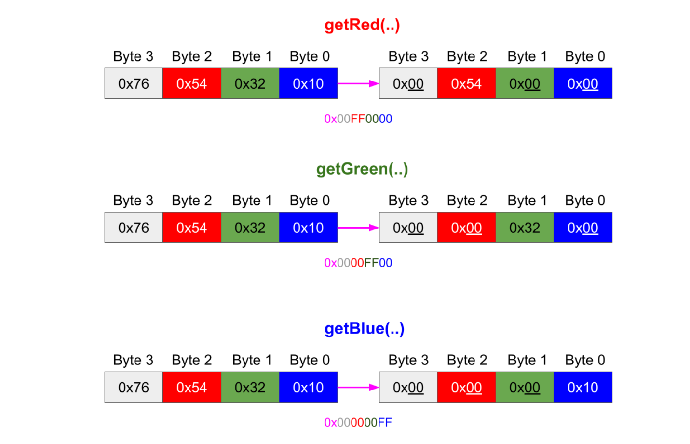

Image processing
===
# ARGB 
|`Byte3`| `Byte2`| `Byte1` | `Byte0`|  gives  a integer value for the color pixel.
- ***A*** - Alpha(transparency) `Byte3`
- ***R*** - RED `Byte2`
- ***G*** - GREEN `Byte1`
- ***B*** - BLUE `Byte0`

* HSL and HSV - Hue, Saturation, Lightness/Brightness


### getBlue( int rgb)

**We extract individual component of a pixel, e.g blue**

In order to get a particular component (red, green, or blue), we need to first get rid of all the other color components in the pixel, while keeping the desired component.

To achieve this we apply a `bitmask`.

**A `bitmask` defines which bits we want to keep, and which bits we want to clear.**

> We apply a bitwise AND with 0x00 (0000 0000 in binary) to get rid of a component since X AND 0 = 0, for any X.

> We apply a bitwise AND with 0xFF (1111 1111 in binary) to keep the value of a component since X AND 1 = X, for any X.

> `bitmask` operation are `rgb & 0x00FF0000` , `rgb & 0x00FF0000` and `rgb & 0x000000FF`
> 
> Now  we need to do `bit shifting` with `>>` to shift the `byte` representing our component to lowest `byte`.
> 
For example in the getRed(..) method, after we apply the bitmask on 0x76543210 we end up with 0x00540000, but what we need is 0x00000054

```
//For BLUEwe don't need to perform any shifting since it's already the right-most byte
public static int getBlue(int rgb) {
    return rgb & 0x000000FF;
}
```

```
// For GREEN we need to move all the bits, 1 byte (8 bits) to the right
public static int getGreen(int rgb) {
    return (rgb & 0x0000FF00) >> 8;
}
```

```
// Bit shifting 
// after we apply the bitmask on 0x76543210 we end up with 0x00540000,
// but what we need is 0x00000054

// RED : move all the bits, 2 bytes (16 bits) to the right.
public static int getRed(int rgb) {
    return (rgb & 0x00FF0000) >> 16;
}

```



## Combining Color Components into a Pixel

Here we do opposite of color component extraction above.
```
public static int createRGBOutOfColors(int red, int green, int blue) {
    int rgb = 0;
 
    rgb |= blue;
    rgb |= green << 8;
    rgb |= red << 16;
 
    rgb |= 0xFF000000;
 
    return rgb;
}
```

* Blue is placed at the lowest byte so we simply bitwise OR the pixel color representation with the blue component

* Green needs to be placed at the second byte so it is first shifted 1 byte (8 bits) to the left, and then is bitwise ORed with the pixel color

* Similarly, red needs to be placed at the third byte so its component is shifted 2 bytes (16 bits) to the left, and then it is bitwise ORed with the pixel color